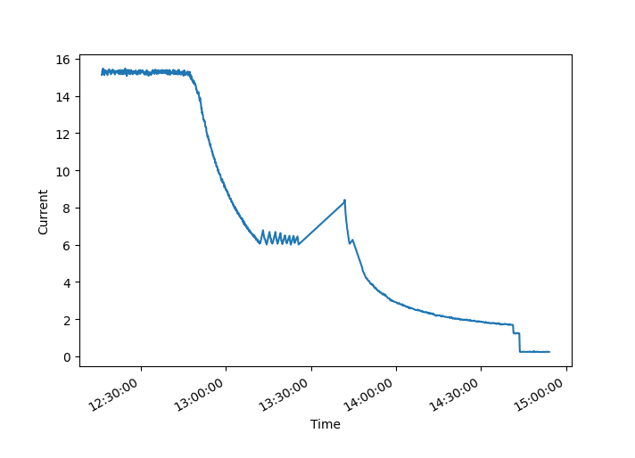
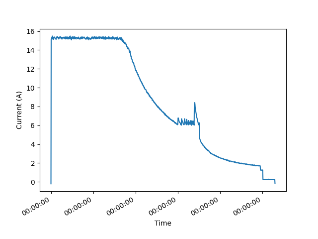

# The Battle of AI Agents: CoPilot vs. TaskWeaver in Time-Series Data Analysis
In the ever-evolving world of data science, efficient tools are crucial for productivity. I embarked on a journey to compare two AI-driven coding agents, CoPilot and TaskWeaver, to analyze a time-series dataset. This article documents my experiences, challenges, and findings while using both tools for the same task. For a detailed look at the prompts, code, and outputs, visit my [GitHub repository](https://github.com/zenetio/CoPilot-vs-TaskWeaver).

The left half shows CoPilot’s process: setting up the environment, iterating through prompts (prompt-1 to prompt-5), and the final output graph. The right half shows TaskWeaver’s process: handling configuration issues, refining prompts (prompt-1 to prompt-6), and the final output graph. Include text annotations for key steps, and use arrows to indicate the workflow for each tool. The CoPilot side emphasizes ease and speed, while the TaskWeaver side highlights detailed planning and automatic code checking.

## CoPilot: The Journey Begins
### Setting Up
Starting with CoPilot, an extension for VS Code, I created my first prompt (prompt-1). The generated Python code attempted to use the csv module. However, none of [my curated list of Conda environments](https://github.com/zenetio/envs-curated-list) had the csv module installed. So, I decided to create a new Conda environment named csv, with the necessary requirements.

Start of dataset.csv

### Iterative Refinement
After resolving environment issues, I executed the generated script, which worked but displayed the X-axis in seconds — an impractical format for my needs. I refined the prompt (prompt-2) to format the X-axis as ‘%H:%M:%S’. Surprisingly, this iteration introduced a float error, requiring further refinement. In summary, it took five iterations (prompt-5) and approximately 40 minutes to achieve the desired result. Although CoPilot struggled with some tasks, it provided a [usable solution](https://github.com/zenetio/CoPilot-vs-TaskWeaver/blob/main/copilot/output/plot-5.png) after multiple adjustments.

Copilot Solution

## TaskWeaver: An Alternative Approach
### Initial Setup
Next, I switched to TaskWeaver, already installed and running locally. Using the same initial prompt (prompt-1) as for CoPilot, TaskWeaver impressed me by immediately using the **DateFormatter**(“%H:%M:%S”) to get the required output. However, it faced a configuration issue saying “the dataset file was not found” — a human error on my part.

### Overcoming Challenges
Subsequent prompts (prompt-2 and prompt-3) aimed to correct file path issues and formatting errors. By prompt-5, I simplified the task by focusing on two columns: TIMESTAMP and CURRENT. Despite this, TaskWeaver struggled with some aspects, such as handling predefined string dates I was trying to pass as input. After six prompts and many sessions, TaskWeaver still had [issues with the X-axis values](https://github.com/zenetio/CoPilot-vs-TaskWeaver/blob/main/taskweaver/output/plot-6.png), which I resolved removing the input values and using CoPilot to apply the correct formatting.

Taskweaver failed to display the x-axis values properly

## Comparative Analysis
### CoPilot
#### Pros:
- Fast and easy to use.
- Generates nice documentation and the output is commented in detail.
- Allows for iterative refinement within a single conversation.

#### Cons:
- Struggles with some specific tasks.
- Requires manual intervention for environment setup and issue resolution.

### TaskWeaver

#### Pros:
- Detailed task planning and execution.
- Code checker automatically attempts to fix issues.
- You can learn while you see Taskweaver fixing issues.

#### Cons:
- Slower than CoPilot.
- Documentation on configuration and usage could be improved.

## Conclusion

Both CoPilot and TaskWeaver have their strengths and weaknesses. CoPilot is more user-friendly and quicker for straightforward tasks, while TaskWeaver offers a more detailed and automated approach but requires more setup and troubleshooting. The journey highlighted that CoPilot and TaskWeaver are designed for different use cases: CoPilot excels in conversational assistance and quick problem-solving, whereas TaskWeaver focuses on detailed task execution within workflows.

In the end, both tools contributed to solving the time-series analysis problem, demonstrating their potential in data analysis tasks and collaborative partnership.
Where each one was good and bad to solve the same task.
## Next steps

Future comparisons with other agents like CrewAI and Autogen will further explore the landscape of AI-driven coding assistants.

Stay tuned for more insights and comparisons in my next exploration of AI agents!

For complete details, visit my [GitHub repository](https://github.com/zenetio/CoPilot-vs-TaskWeaver).

Thanks for reading. If you think it’s helpful, please clap 👏 for this article. Your encouragement and comments mean a lot to me, mentally and financially. 😊

#### My contacts

[Linkedin](https://www.linkedin.com/in/carlos-lacerda-3789645/) | [YouTube](https://www.youtube.com/channel/UC1bYt9VX4O6bl6-cmHH8jgQ) | [GitHub](https://github.com/zenetio) | [Twitter](https://twitter.com/carlosrl0310)

